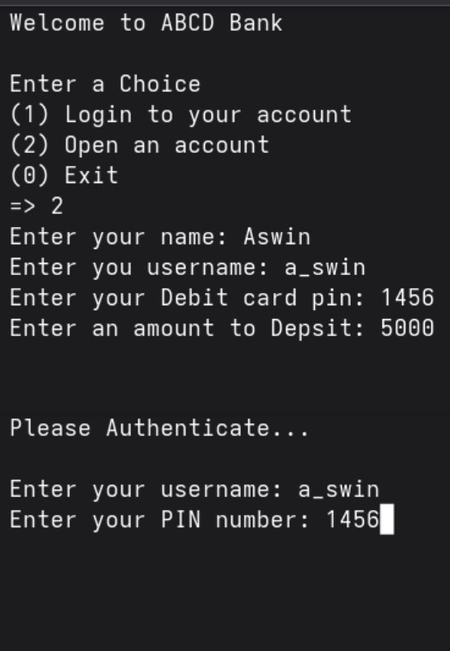
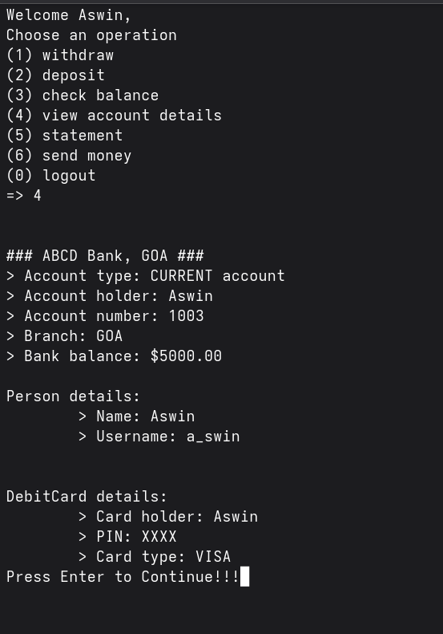
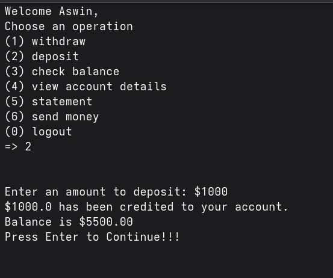
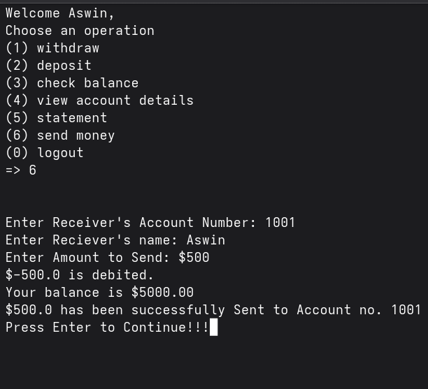
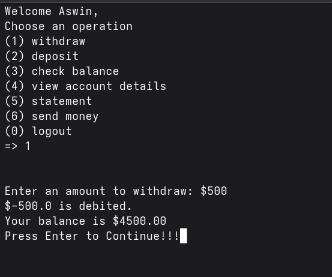
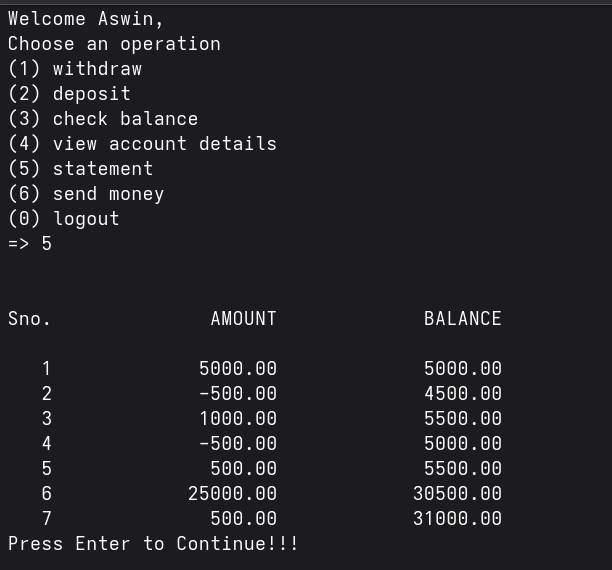

# Bank Management System

### Project Description
As a part of learning the concept of classes and objects in python a project was carried out to learn and explore more about the language. More than those learnt from the courses, I could learn more about the concepts of objects and classes by researching on my own and clearing my doubts.
    You can simulate Withdrawal, Deposition, Money sending, etc... in the demonstrated project

### The Problem
To study the Concepts of Objects and Classes in Python

### The Solution
The concept of Objects and classes have been familiarized

## Technical Details
### Technologies/Components Used
For Software:
- Python
- MySQL

### Implementation
For Software: Python3, MySQL 8.0
# Installation
For Linux: Run the following commands in the terminal one by one
- sudo apt install python3.13
- sudo apt install python3-pip
- sudo apt install mysql-server -y
- sudo mysql_secure_installation
-   Follow the prompts:
-       Set a root password ✅
-       Remove anonymous users ✅
-       Disallow remote root login ✅
-       Remove test database ✅
-       Reload privilege tables ✅
- sudo systemctl start mysql
- sudo systemctl enable mysql
- Login to MySQL
-   sudo mysql -u root -p
-       CREATE DATABASE bank_account;
- pip install mysql.connector

For Windows Download python installer from python.org and MySQL local server and install and run the following command.
- pip install mysql.connector
- login to mysql and create the database "bank_account"

## Run
python3 main.py

# Project Demo
## Screenshots
### Creating Account and Loggin in

### Getting Account Details

### Depositing Money

### Sending Money

### Withdrawing Money

### Account Statement

